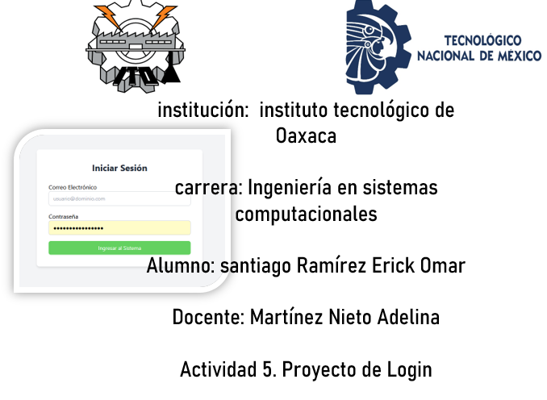
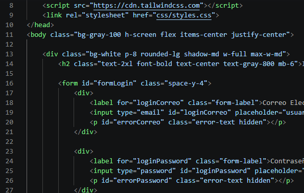
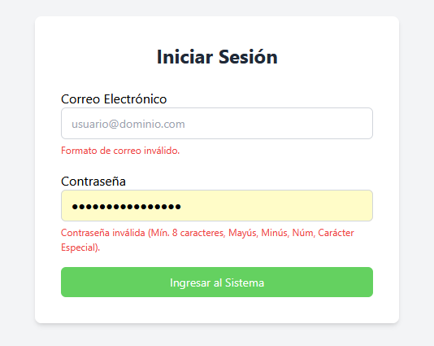
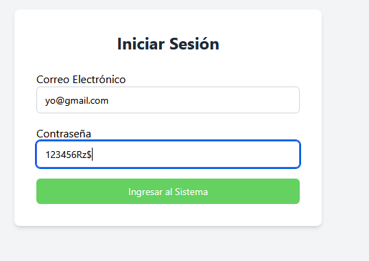
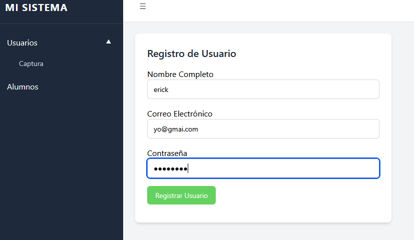
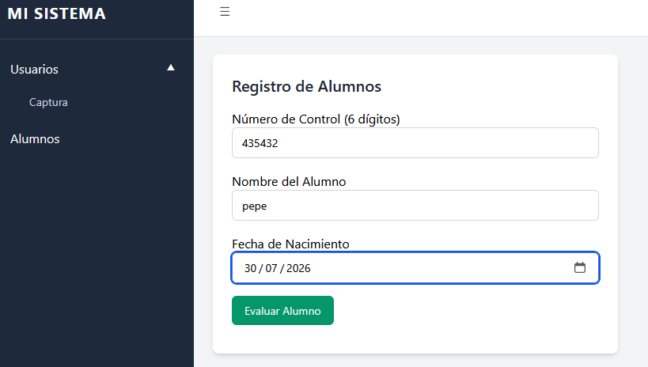
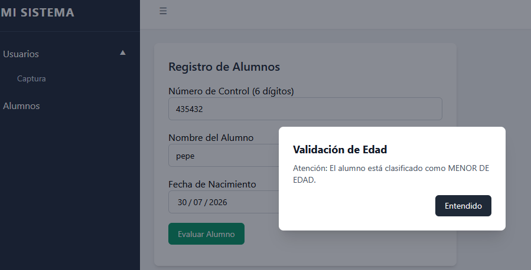
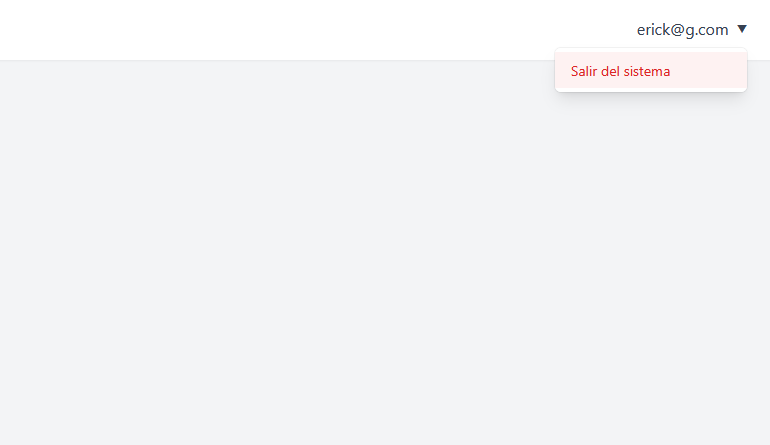

# Proyecto-de-Login



 login funcional en HTML, CSS y JS que simula el acceso a un sistema

Este proyecto consiste en el formulario del login el cual usa nuestro componente hecho con js anteriromente en mi caso utileria,js que se ecnuntra en el reposiorio ``` https://erickomar4.github.io/utileria_erick.js/ ```
en la carpeta js, asi cmo de forma local en este proyecto para usarlo solo se be refernciar el archivo en el body del html usando 
```
<script src="js/utileria.js"></script>
```
en este proyetco implemente 
###  Framework CSS Seleccionado
 **Tailwind CSS** mediante su distribución oficial por CDN como el motor principal de diseño adaptativo y control estructural. ya quermite maquetar layouts complejos y fluidos (como el menú colapsable o modales flotantes) de forma ágil mediante clases de utilidad.
*   **Optimización del código:** Para evitar la saturación del código HTML (un problema común en Tailwind), los estilos de componentes repetitivos como campos de entrada (`.form-input`), etiquetas (`.form-label`) y botones (`.btn-primary`, `.btn-secondary`) se extrajeron limpiamente hacia un archivo nativo `css/styles.css`.



###  Flujo de Navegación (Autenticación en Cliente)
El proyecto utiliza un flujo de redirección asíncrono basado en el estado. Cuando el usuario envía el formulario de acceso, `js/login.js` intercepta el evento e invoca las funciones de validación. Si los datos son correctos, el script otorga un token temporal de acceso directo utilizando la API de almacenamiento web del navegador:
```
$$\text{Formulario Válido} \longrightarrow \text{Asignación en LocalStorage} \longrightarrow \text{Redirección por Window Location}$$
```
Al cargar `index.html`, un script de seguridad perimetral comprueba la existencia de dicho token; si el espacio está vacío, deniega el acceso redirigiendo inmediatamente al usuario de vuelta al inicio.

###  uso del Navbar
La transferencia de la identidad del usuario entre las dos páginas independientes se realiza mediante **`localStorage`**:
1.  En `login.js`, al pasar las reglas de validación, se ejecuta: 
    ```javascript
    localStorage.setItem('usuarioSesion', correo);
    ```
2.  Al inicializar `index.html`, el script `js/sistema.js` recupera la cadena de texto y la inyecta directamente en el nodo de texto de la barra superior:
    ```javascript
    const usuarioLogueado = localStorage.getItem('usuarioSesion');
    document.getElementById('navbarUsuario').textContent = usuarioLogueado;
    ```
use los metodos de validarCorreo() y validarPassword para el login y lo aplicamos en el archivo login.js para mostar los errores al hacer la validacion 



al ingresar los datos de forma  correcta nos no enviara al sistema,


 donde podemos simular el registro de un usuario, para usar nuestra libreria de js

 


asi como el registro de alumnos el cual usamos un modal para mostrar si es mayor o menor de edad




en el lado derecho del pograma en el navbar se refleja el correo con el que se ingreso, asi como un boton para salir el cual re direcciona al login 

